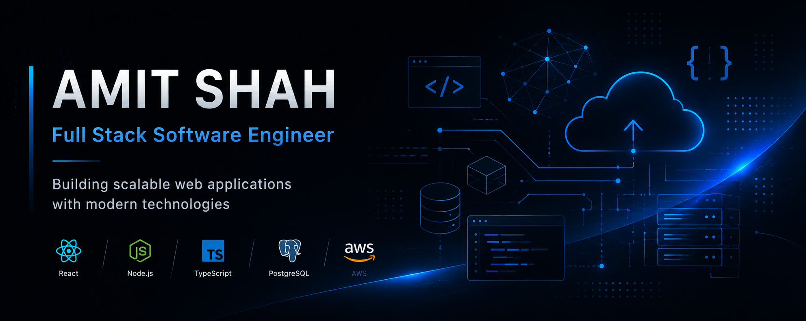

<!-- ========================================================= -->
<!--                    GITHUB PROFILE README                  -->
<!--                Designed for Amit Shah                     -->
<!-- ========================================================= -->

<!-- Banner -->

  

<h1 align="center">Amit Shah</h1>

  <strong>Full Stack Software Engineer</strong>

Building scalable web applications with modern technologies.

  

  

  

  

---

## 👋 About Me

I'm a final-year **B.Tech Computer Science Engineering** student at **Silver Oak College of Engineering and Technology**, Ahmedabad, with a strong interest in building scalable, secure, and maintainable software.

My primary focus is **Full Stack Development**, where I enjoy designing responsive user interfaces, developing robust backend services, and building well-structured database architectures.

I believe software engineering is more than writing code—it's about solving real-world problems through thoughtful design, clean architecture, security, and continuous improvement.

I'm currently looking for **Full Stack Software Engineer Internship** and **Software Engineer** opportunities where I can contribute to meaningful products while learning from experienced engineering teams.

---

## 🎓 Education

| Degree | Institution | Duration |
|---------|------------|----------|
| **Bachelor of Technology (B.Tech)** | Silver Oak College of Engineering and Technology | Expected Graduation: **2027** |

**Computer Science & Engineering**

CGPA: **9.25**

Ahmedabad, Gujarat, India

---

## 💼 Currently

- Full Stack Software Engineer Intern Aspirant
- Building production-oriented web applications
- Exploring scalable backend architectures
- Strengthening JavaScript and React ecosystem
- Learning modern backend engineering practices
- Improving problem-solving and software design skills

---

## 🚀 Engineering Principles

I enjoy building software that is:

- Maintainable
- Secure
- Modular
- Scalable
- Well documented

When developing applications, I focus on:

- Clean Architecture
- Readable code
- RESTful API design
- Authentication & Authorization
- Database normalization
- Code reusability
- Performance optimization
- Long-term maintainability

---

## 📌 Current Focus

Currently working with modern JavaScript technologies and building production-style applications.

### Learning

- Advanced React
- Node.js
- Express.js
- PostgreSQL
- Prisma ORM
- Backend Architecture
- API Design
- Authentication & Authorization
- Software Design Patterns

---

## 🌱 Looking For

I'm interested in opportunities involving:

- Full Stack Development
- Backend Engineering
- SaaS Products
- REST API Development
- Cloud-based Applications
- Modern Web Technologies
- Product Engineering

---

## 📫 Connect

- 📧 Email: **shahamitsuresh@gmail.com**
- 💼 LinkedIn: **linkedin.com/in/amitshahstack**
- 💻 GitHub: **github.com/amitshahworks**
- 🌐 Portfolio: *Coming Soon*
- 🧩 LeetCode: **leetcode.com/amitshahcodes**

---

# 🛠️ Technical Skills & Engineering Stack

I work across the full software development lifecycle — from designing user interfaces and building backend services to managing databases, APIs, authentication systems, and deployment workflows.

---

## 💻 Programming Languages

---

# 🌐 Frontend Development

**Frontend Practices**

- Component-based architecture
- Responsive UI development
- State management concepts
- API integration
- Reusable component design
- Performance optimization

---

# ⚙️ Backend Development

**Backend Practices**

- RESTful API development
- Server-side application design
- Middleware architecture
- Request validation
- Error handling
- Authentication workflows
- Secure API development

---

# 🗄️ Database & Data Management

**Database Knowledge**

- Relational database design
- Schema modeling
- Query optimization basics
- ORM-based development
- Data validation
- Database security practices

---

# 🔐 Authentication & Security

**Security Concepts**

- JWT authentication
- Refresh token workflows
- Role-Based Access Control
- Authorization middleware
- Password hashing
- Protected routes
- Secure API practices
- Input validation

---

# ☁️ Cloud & DevOps

**Cloud & Deployment Knowledge**

- Cloud fundamentals
- Application deployment concepts
- Containerization basics
- Environment configuration
- CI/CD concepts

---

# 🧰 Developer Tools

**Development Workflow**

- Git branching workflow
- Version control
- API testing
- Debugging
- Environment management
- Documentation practices

---

# 🤖 AI & Emerging Technologies

**AI Interests**

- Generative AI applications
- AI-powered software products
- AI API integration
- MLOps fundamentals

---

# 📚 Computer Science Foundations

- Data Structures & Algorithms
- Object-Oriented Programming
- Database Management Systems
- Operating Systems
- Computer Networks
- Software Development Life Cycle
- Agile Development Practices

---

# 🧠 Core Engineering Skills

| Area | Skills |
|---|---|
| Problem Solving | Data Structures, Algorithms, Debugging |
| Backend Engineering | REST APIs, Authentication, Authorization |
| Database Design | Schema Design, ORM, SQL |
| Architecture | Modular Design, Clean Architecture Basics |
| Frontend Engineering | Responsive UI, Component Design |
| Security | JWT, RBAC, Secure API Practices |
| Collaboration | Git Workflow, Documentation, Team Communication |
| Development Process | Agile, Testing, Code Quality |

---
